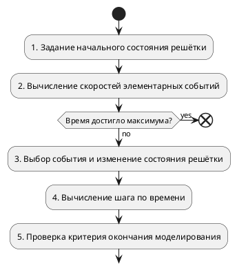
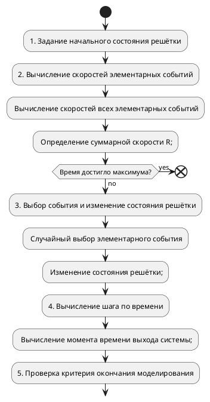
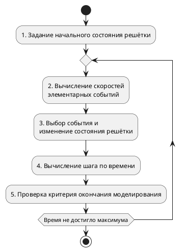
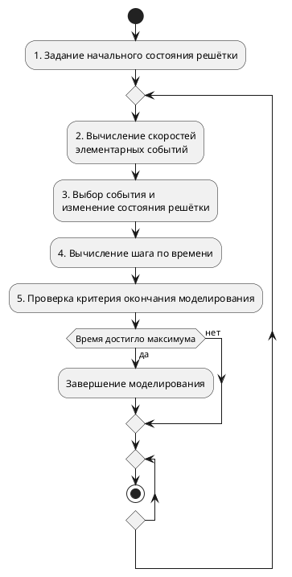
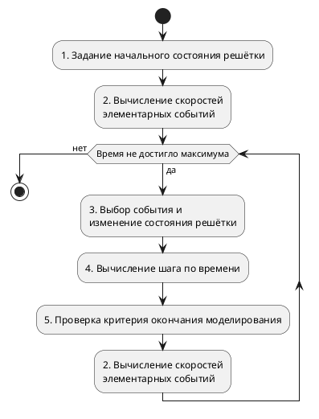

```
Exported with AIPRM https://www.aiprm.com by ruitang.task@outlook.com on 16.03.2023, 13:08:30
```

---


**User:**
我有三种读博选择：
1. 在莫斯科，就读莫斯科国立大学的应用数学博士
2. 在深圳，就读深圳北理莫斯科大学的应用数学博士
3. 在上海，就读华东师范大学的应用数学博士

你觉得我该如何考虑，进行选择？

---

**ChatGPT:**
在选择读博项目时，你可以从以下几个方面进行考虑：
<li><p>学术声誉：每个学校在应用数学领域的学术声誉和排名可能不同。了解这些信息可以帮助你选择一个在全球范围内受到尊重的项目。你可以查阅学术排名、教师出版物、研究项目等方面的信息，以评估各个学校在应用数学领域的实力。</p></li><li><p>导师资源：了解各个学校的导师资源，包括他们的研究方向、成果以及与学生的互动情况。选择一个与你的研究兴趣和目标契合的导师非常重要。</p></li><li><p>项目结构和课程设置：不同学校的博士项目结构和课程设置可能有所不同。了解这些信息，以确保你选择的项目能满足你的学术需求和职业发展。</p></li><li><p>地理位置：考虑自己对于生活在不同城市的喜好和需求。莫斯科、深圳和上海这三个城市的文化、气候和生活成本都有很大差异。了解这些差异，以便选择一个适合自己生活的城市。</p></li><li><p>学费和奖学金：了解各个学校的学费、奖学金和助学金政策，评估自己能否承担相应的费用。</p></li><li><p>就业前景：研究各个学校的毕业生在应用数学领域的就业情况，了解他们在学术界和工业界的发展。这可以帮助你评估各个项目的长期价值。</p></li>
综合以上几个方面的信息，你可以进行权衡，根据自己的需求和目标做出最佳选择。祝你找到满意的博士项目！

---

**User:**
Рассматриваются пять возможных элементарных событий, которые могут происходить с интенсивностями k1
, k2
, k3
, d = d1 = d2
. Стадии (4)-(5) описывают процесс миграции по обменному механизму
на ближайшие соседние узлы.
В рассматриваемой микромодели учитывается ограниченное число контактов между людьми, для
этого вводятся пространственная решётка и процесс миграции (перемешивания) отдельных
индивидуумов. Это даёт возможность выделить один параметр (d), который определяет скорость
перемешивания в популяции и, тем самым, неявно учитывает всевозможные ограничительные
факторы. Случай d=0 соответствует строгим карантинным мероприятиям. Случай d  ∞ соответствует
макромодели SIRS и полному перемешиванию, которое реально никогда не выполняется.

Please rewrite this sentence in Russian，More short, more logical, more clear expressions

---

**ChatGPT:**
Рассмотрим микромодель с пятью возможными элементарными событиями, происходящими с интенсивностями k1, k2, k3, d = d1 = d2. В модели учитывается ограниченное число контактов между людьми, используя пространственную решётку и процесс миграции индивидуумов. Параметр d определяет скорость перемешивания в популяции и учитывает различные ограничительные факторы. Случай d=0 соответствует строгим карантинным мерам, а d → ∞ приближается к макромодели SIRS с полным перемешиванием, которое на практике невозможно.

---

**User:**
\frac{d \mathrm{P}_{i}(t)}{d t}=\sum_{j \neq i}\left(\mathrm{P}_{j}(t) \lambda_{j i}(t)-\mathrm{P}_{i}(t) \lambda_{i j}(t)\right), \quad i=1,2, \ldots, N_{e q}, N_{e q}=3^{N}

 \mathrm{P}_{i}  - вероятность состояния решетки с номером  i 
 \lambda_{i j}-  скорость перехода из состояния  i  в состояние  j  [ед. вр.  { }^{-1}  ]

请帮我讲解一下其中的这个公式，我没有看懂

---

**ChatGPT:**
这个公式描述了一个离散时间马尔可夫链的演化过程。在这里，$\mathrm{P}<em>{i}(t)$ 是在时刻 $t$ 处于状态 $i$ 的概率，$\lambda</em>{ij}(t)$ 是从状态 $i$ 转移到状态 $j$ 的转移速率。
公式的左侧 $\frac{d \mathrm{P}_{i}(t)}{d t}$ 表示状态 $i$ 的概率随时间的变化率。公式的右侧包含两部分，分别对应进入状态 $i$ 的贡献和离开状态 $i$ 的贡献。
<li><p>第一部分：$\sum_{j \neq i} \mathrm{P}<em>{j}(t) \lambda</em>{ji}(t)$ 表示从所有其他状态 $j \neq i$ 转移到状态 $i$ 的总速率。这里，$\mathrm{P}<em>{j}(t)$ 是在时刻 $t$ 处于状态 $j$ 的概率，$\lambda</em>{ji}(t)$ 是从状态 $j$ 转移到状态 $i$ 的转移速率。求和表示我们将所有这样的贡献累加起来。</p></li><li><p>第二部分：$\sum_{j \neq i} \mathrm{P}<em>{i}(t) \lambda</em>{ij}(t)$ 表示从状态 $i$ 转移到所有其他状态 $j \neq i$ 的总速率。这里，$\mathrm{P}<em>{i}(t)$ 是在时刻 $t$ 处于状态 $i$ 的概率，$\lambda</em>{ij}(t)$ 是从状态 $i$ 转移到状态 $j$ 的转移速率。求和表示我们将所有这样的贡献累加起来。</p></li>
所以，这个方程描述了在离散时间马尔可夫链中，状态 $i$ 的概率随时间的变化是由从其他状态转移到状态 $i$ 的速率与从状态 $i$ 转移到其他状态的速率之差决定的。

---

**User:**
Please translate into Russian

---

**ChatGPT:**
Это уравнение описывает эволюцию дискретной временной марковской цепи. Здесь $\mathrm{P}<em>{i}(t)$ - вероятность нахождения в состоянии $i$ в момент времени $t$, а $\lambda</em>{ij}(t)$ - скорость перехода из состояния $i$ в состояние $j$.
Левая часть уравнения $\frac{d \mathrm{P}_{i}(t)}{d t}$ описывает изменение вероятности состояния $i$ со временем. Правая часть уравнения состоит из двух частей, которые соответствуют вкладу перехода в состояние $i$ и вкладу выхода из состояния $i$.
<li><p>Первая часть: $\sum_{j \neq i} \mathrm{P}<em>{j}(t) \lambda</em>{ji}(t)$ представляет общую скорость перехода из всех других состояний $j \neq i$ в состояние $i$. Здесь $\mathrm{P}<em>{j}(t)$ - вероятность нахождения в состоянии $j$ в момент времени $t$, а $\lambda</em>{ji}(t)$ - скорость перехода из состояния $j$ в состояние $i$. Суммирование означает, что мы накапливаем все такие вклады.</p></li><li><p>Вторая часть: $\sum_{j \neq i} \mathrm{P}<em>{i}(t) \lambda</em>{ij}(t)$ представляет общую скорость перехода из состояния $i$ во все другие состояния $j \neq i$. Здесь $\mathrm{P}<em>{i}(t)$ - вероятность нахождения в состоянии $i$ в момент времени $t$, а $\lambda</em>{ij}(t)$ - скорость перехода из состояния $i$ в состояние $j$. Суммирование означает, что мы накапливаем все такие вклады.</p></li>
Таким образом, это уравнение описывает, как вероятность состояния $i$ изменяется со временем в дискретной временной марковской цепи, определяемая разностью между скоростью перехода из других состояний в состояние $i$ и скоростью перехода из состояния $i$ в другие состояния.

---

**User:**
请帮我讲解一下这部分PPT，并帮我取一个名字

---

**ChatGPT:**
很抱歉，您没有提供PPT的具体内容。请您提供PPT的相关内容和主题，以便我为您讲解并为您的PPT起一个合适的名字。

---

**User:**
请帮我讲解一下这部分PPT，并帮我给这一页PPT去一个标题名

Используем пространственную стохастическую агентно-ориентированную модель, в которой
эволюция системы описывается марковским случайным процессом с дискретным множеством
состояний и непрерывным временем, а потоки событий являются независимыми пуассоновскими
потоками с заданными интенсивностями.
Изменение во времени вероятностей наблюдения всех возможных дискретных состояний решётки 
описывается основным кинетическим уравнением (ОКУ, “master equation”) :
 
        
P
P P , 1,2,..., , 3 i N
j ji i ij eq eq
d t
t t t t i N N
dt j i
     


Pi
 – вероятность состояния решетки с номером i
ij – скорость перехода из состояния i в состояние j [ед. вр.
-1
]
Предположение о случайном перемешивании, которое реализуется при d  , позволяет получить
из ОКУ макромодель SIRS (при N  ) или уравнения Фоккера-Планка при достаточно больших, но
конечных размерах системы N.
Для решёточной микромодели SIRS ОКУ содержит 3
N линейных ОДУ первого порядка. Решать такую
систему невозможно даже при использовании маленьких решёток. Например, для решетки размера
10×10, Neq
 5.2×1047
. Однако можно рассчитать отдельные траектории эволюции системы, используя
кинетический метод Монте-Карло (“Kinetic Monte Carlo”, KMС). Существует несколько статистически
эквивалентных вариантов реализации метода KMС. Один из таких вариантов называется прямым
методом (“direct method”) и относится к варианту алгоритмов “без отказов” (“rejection-free”).


---

**ChatGPT:**
这一页PPT的标题可以是：“基于格子的SIRS微观模型与动力学蒙特卡洛方法”。
这部分PPT介绍了一种基于空间随机的、面向代理的模型，其中系统的演变由一个具有离散状态集合和连续时间的马尔可夫随机过程描述，事件流是独立的泊松流，具有指定的强度。通过主动力学方程（master equation）描述了所有可能的离散格子状态的观测概率随时间的变化。在这里，$P_i$ 表示具有编号 $i$ 的格子状态的概率，$\lambda_{ij}$ 表示从状态 $i$ 转换到状态 $j$ 的转换速率。
在随机混合假设下，当 $d \rightarrow \infty$ 时，可以从主动力学方程中得到SIRS宏观模型（当 $N \rightarrow \infty$ 时）或者在足够大但有限的系统大小 $N$ 下的Fokker-Planck方程。
对于SIRS微观模型，主动力学方程包含 $3^N$ 个一阶线性常微分方程。即使对于较小的格子尺寸，也无法求解这样的方程组。例如，对于10×10的格子，$N_{eq} \approx 5.2 \times 10^{47}$。然而，可以使用动力学蒙特卡洛（Kinetic Monte Carlo, KMC）方法计算系统演化的单独轨迹。有几种在统计上等价的KMC方法实现。其中一种称为直接方法（direct method），属于无拒绝（rejection-free）算法的变种。

---

**User:**
Please translate in Russian

---

**ChatGPT:**
Заголовок для этой страницы PPT можно предложить такой: "Микромодель SIRS на решетке и кинетический метод Монте-Карло".
Данная часть PPT описывает пространственную стохастическую агентно-ориентированную модель, где эволюция системы представлена марковским случайным процессом с дискретным множеством состояний и непрерывным временем, а потоки событий являются независимыми пуассоновскими потоками с заданными интенсивностями. Изменение вероятностей наблюдения всех возможных дискретных состояний решетки во времени описывается основным кинетическим уравнением (ОКУ). Здесь $P_i$ - вероятность состояния решетки с номером $i$, $\lambda_{ij}$ - скорость перехода из состояния $i$ в состояние $j$.
Предположение о случайном перемешивании, которое реализуется при $d \rightarrow \infty$, позволяет получить из ОКУ макромодель SIRS (при $N \rightarrow \infty$) или уравнения Фоккера-Планка при достаточно больших, но конечных размерах системы $N$.
Для решеточной микромодели SIRS ОКУ содержит $3^N$ линейных ОДУ первого порядка. Решать такую систему невозможно даже при использовании маленьких решеток. Например, для решетки размера 10×10, $N_{eq} \approx 5.2 \times 10^{47}$. Однако можно рассчитать отдельные траектории эволюции системы, используя кинетический метод Монте-Карло (KMC). Существует несколько статистически эквивалентных вариантов реализации метода KMC. Один из таких вариантов называется прямым методом и относится к варианту алгоритмов "без отказов".

---

**User:**
在Решёточная агентно-ориентированная модель SIRS中，系统的演变有一个具有离散状态的集合和连续时间的马尔可夫随机过程描述，事件流是独立的泊松流，具有指定的轻度。在随机混合假设下，我们可以通过主动力学方程（master equation）描述所有可能的离散格子状态的观测概率随时间的变化：

---

**ChatGPT:**
В решеточной агентно-ориентированной модели SIRS, эволюция системы описывается марковским случайным процессом с дискретным множеством состояний и непрерывным временем. Потоки событий являются независимыми пуассоновскими потоками с заданными интенсивностями. При предположении случайного перемешивания, мы можем описать изменение вероятностей наблюдения всех возможных дискретных состояний решетки во времени с помощью основного кинетического уравнения (ОКУ, "master equation").

---

**User:**
计算数学和应用数学的区别

---

**ChatGPT:**
计算数学和应用数学是两个密切相关但有所区别的数学分支。
计算数学（Computational Mathematics）主要关注数学方法和技术在计算机上的实现和应用。它强调用于解决数学问题的计算方法和算法的研究、开发和分析。计算数学的主要领域包括：
<li>数值分析：研究用数值方法近似解决数学问题，如微积分、代数方程、积分方程和微分方程。</li><li>优化：寻求最大化或最小化某一目标函数的方法和算法。</li><li>计算几何：研究在计算机上处理几何对象和结构的算法。</li><li>符号计算：处理代数表达式、微积分和方程的符号操作。</li>
应用数学（Applied Mathematics）则关注数学理论和方法在各种现实世界问题中的应用。应用数学通常涉及建立和分析数学模型，以解决与自然科学、工程、社会科学等领域的问题。应用数学的主要领域包括：
<li>数学物理：解决物理学领域中的问题，如流体力学、量子力学和相对论。</li><li>概率论和统计：处理数据和随机现象的数学理论。</li><li>生物数学：研究生物学领域的数学模型，如生态系统、神经网络和基因组学。</li><li>工程数学：解决工程领域的问题，如结构力学、控制理论和信号处理。</li>
尽管计算数学和应用数学在重点和方法上有所不同，但它们之间存在很大的交叉和互动。许多应用数学问题需要计算数学方法进行求解，而计算数学技术的发展受到应用数学问题的启发和驱动。

---

**User:**
微分方程和动力系统是什么

---

**ChatGPT:**
微分方程和动力系统是数学和应用数学中的两个重要概念，它们在自然科学和工程学科中有广泛应用。
<li>微分方程：微分方程是一种数学方程，其中包含了未知函数及其导数。微分方程通常用于描述系统的动态行为，例如物体的运动、化学反应的速率或者生物种群的增长。微分方程可以分为两类：</li>
<li>常微分方程（Ordinary Differential Equations，ODE）：涉及一个或多个自变量的函数及其一阶或更高阶导数。例如，牛顿运动定律可以表示为一个二阶常微分方程。</li><li>偏微分方程（Partial Differential Equations，PDE）：涉及多个自变量的函数及其偏导数。例如，热传导方程、波动方程和薛定谔方程都是典型的偏微分方程。</li>
<li>动力系统：动力系统是一个数学描述时间演变的系统，通常由一组常微分方程或差分方程表示。动力系统的研究涉及系统的稳定性、周期性、混沌等性质。动力系统在自然科学、工程学和社会科学等领域有广泛应用。</li>
动力系统的主要类型包括：
<li>连续时间动力系统：这类系统通常由常微分方程组描述。例如，洛伦兹方程和梅尔森方程是连续时间动力系统的示例。</li><li>离散时间动力系统：这类系统通常由差分方程组描述。例如，逻辑增长模型和Mandelbrot集是离散时间动力系统的示例。</li>
微分方程和动力系统在许多实际问题中具有重要应用，例如物理学、生物学、化学、经济学和工程学中的模型和预测。通过研究微分方程和动力系统，我们可以理解许多自然现象和人造系统的内在规律。

---

**User:**
什么是动力学模型？
动力学和动力系统有什么区别？

---

**ChatGPT:**
动力学模型是一种数学模型，用于描述系统随时间演变的行为。这类模型通常基于物理定律、生物学规律或其他基本原理来表示系统中各个变量之间的相互作用和依赖关系。动力学模型可以用常微分方程、偏微分方程、差分方程或其他类型的方程来表示。
动力学模型的一些常见应用领域包括：
<li>生物学（例如种群动态、疾病传播和生态系统模型）</li><li>物理学（例如力学系统、电磁学和热力学）</li><li>工程学（例如控制系统、结构力学和流体力学）</li><li>经济学（例如宏观经济模型、金融市场和供需平衡）</li>
动力学和动力系统的区别：
动力学主要关注研究系统随时间演变的行为，如物体运动、化学反应速率或生物种群增长。动力学模型可以是确定性的或随机的，通常用微分方程或差分方程表示。
动力系统是一个更广泛的概念，用于描述由一组相互作用的变量组成的系统随时间的演变。动力系统理论关注系统的稳定性、周期性、混沌等性质。动力系统可以是连续的（由常微分方程表示）或离散的（由差分方程表示）。
总之，动力学通常关注特定类型的动态行为，而动力系统涉及对时间演变系统的更一般性研究。这两个概念在许多情况下是相互关联的，特别是在自然科学和工程领域。

---

**User:**

Эволюция рассматриваемой системы подчиняется основному кинетическому уравнению (“master equation”), описывающему изменение во времени вероятностей наблюдения всех возможных дискретных состояний решётки. Для моделей SIR/SIRS основное кинетическое уравнение содержит 3N линейных ОДУ первого порядка. Решать такую систему невозможно даже при использовании маленьких решёток, например, для решётки размеров 10×10 система уже содержит более 1047 уравнений. Однако можно рассчитать отдельные траектории эволюции системы, используя кинетический метод Монте-Карло (“Kinetic Monte Carlo”, KMC [6,7]). Существует несколько статистически эквивалентных вариантов реализации кинетического метода Монте-Карло (МК). Один из таких вариантов при имитации процесса реакции на решётке состоит из следующих этапов.
I. Задание начального состояния решётки.
II. Вычисление скоростей элементарных событий. На текущий момент времени t_1 вычисляются скорости всех возможных элементарных событий, переводящих решётку в новое состояние; затем вычисляется суммарная скорость R.
III. Выбор события и изменение состояния решётки. Случайно выбирается одно из возможных элементарных событий с вероятностью, пропорциональной его скорости. Изменяется состояние решётки в соответствии с выбранным событием.
IV. Вычисление шага по времени. Вычисляется момент времени t_2 выхода системы из текущего состояния: t_2=t_1-("ln"(ξ)/R), где ξ  случайная величина, равномерно распределённая на интервале (0,1). Осуществляется переход на следующий шаг к этапу II, если не достигнуто заданное максимальное значение времени.
Этот вариант кинетического метода МК называется прямым методом (“direct method” []) и относится к варианту алгоритмов “без отказов” (“rejection-free”). По нашему опыту, прямой метод является наиболее универсальным и эффективным, однако он требует написания достаточно сложных алгоритмов для работы с большими массивами данных. Обычно вычисление скоростей всех возможных элементарных актов (этап II) достаточно выполнить только в начальный момент времени, а в дальнейшем можно вычислять лишь те скорости, которые изменились в результате осуществления выбранного элементарного события. Наиболее затратным по времени счёта является этап выбора одного события (этап III). Если этот выбор правильно организован, то число арифметических операций на каждом временном шаге алгоритма практически не зависит от размеров решётки, что позволяет проводить расчёты на очень больших решётках. На обычном ноутбуке нами проводились расчёты для модели SIRS на решётках, содержащих до 1010 узлов.

Please translate these graphs from Russian to Chinese 

---

**ChatGPT:**
在所考虑的系统的演变遵循基本动力学方程（“master equation”），描述观察到的所有可能离散格子状态的概率随时间的变化。对于SIR / SIRS模型，基本动力学方程包含3N个一阶线性常微分方程。即使对于使用小网格的情况，也无法求解这样的系统，例如，对于10×10大小的网格，系统已经包含超过10^47个方程。然而，可以使用动力学蒙特卡洛方法（“Kinetic Monte Carlo”，KMC [6,7]）计算系统演变的单个轨迹。有几种统计上等效的动力学蒙特卡洛方法（MK）的实现。其中一个选项在模拟格子上的反应过程中包括以下几个阶段。
I. 设定格子的初始状态。
II. 计算基本事件的速率。在当前时间t_1，计算将格子转换为新状态的所有可能基本事件的速率；然后计算总速率R。
III. 选择事件并更改格子状态。随机选择一个可能的基本事件，其概率与其速率成正比。根据所选事件更改格子状态。
IV. 计算时间步长。计算系统从当前状态退出的时间t_2：t_2 = t_1 - ("ln"(ξ) / R)，其中ξ是在区间(0,1)上均匀分布的随机变量。如果未达到指定的最大时间值，则转到步骤II的下一步。
这种动力学蒙特卡洛方法的变体称为直接方法（“direct method” []），属于“无拒绝”（“rejection-free”）算法的变体。根据我们的经验，直接方法是最通用和高效的，但它需要编写足够复杂的算法来处理大型数据阵列。通常，只需要在初始时刻计算所有可能基本事件的速率（步骤II），然后仅计算由于选择的基本事件实现而发生变化的速率。选择一个事件（步骤III）是计算时间最耗时的阶段。如果正确组织此选择，则算法在每个时间步上的算术操作次数几乎不依赖于格子大小，这使得可以在非常大的格子上进行计算。我们在普通笔记本电脑上进行了SIRS模型在包含多达10^10个节点的网格上的计算。

---

**User:**
Пожалуйста, объясните кинетический метод Монте-Карло (без отказов) в кратких словах

---

**ChatGPT:**
Кинетический метод Монте-Карло (без отказов) — это вычислительный подход, позволяющий моделировать стохастические системы, особенно в случаях, когда аналитическое решение сложно получить или невозможно. Этот метод основан на случайном выборе событий и соответствующем изменении состояний системы. "Без отказов" означает, что все возможные события учитываются сразу, и таким образом, нет необходимости повторять выбор событий, которые не были выбраны с первого раза.
Кратко, метод состоит из следующих этапов:
<li>Задание начального состояния системы.</li><li>Вычисление скоростей (интенсивностей) всех возможных элементарных событий.</li><li>Случайный выбор одного из элементарных событий с вероятностью, пропорциональной его скорости.</li><li>Изменение состояния системы в соответствии с выбранным событием.</li><li>Вычисление временного шага для следующего события и переход к шагу 2, если не достигнуто максимальное значение времени.</li>
Этот метод является эффективным и универсальным, и позволяет моделировать системы с большим количеством элементов или сложными динамическими процессами.

---

**User:**
(алгоритм “без отказов”, алгоритм Гиллеспи для решёточной модели)
是什么意思

---

**ChatGPT:**
"без отказов"是俄语短语，意为“无拒绝”，而"алгоритм Гиллеспи"是指吉列斯皮算法。在这个上下文中，它们指的是用于模拟随机过程的一种计算方法。这种方法是一种蒙特卡罗方法，被称为“无拒绝”的原因是，在选择要发生的事件时，所有可能的事件都被立即考虑在内，不需要多次尝试选择不同的事件。
具体而言，这种算法应用于格子模型，用于研究随机动力学过程，如化学反应、生物过程和物理现象等。无拒绝算法（吉列斯皮算法）在执行过程中不会产生拒绝事件，因此计算效率较高。

---

**User:**
"算法步骤详解"

translate in russian

---

**ChatGPT:**
"Подробное объяснение алгоритма"

---

**User:**
На текущий момент времени   вычисляются скорости всех возможных элементарных событий, переводящих решётку в новое состояние; затем вычисляется суммарная скорость .


---

**ChatGPT:**
На текущий момент времени вычисляются скорости всех возможных элементарных событий, которые переводят решетку в новое состояние; затем вычисляется общая скорость.

---

**User:**
На текущий момент времени   вычисляются скорости всех возможных элементарных событий, переводящих решётку в новое состояние; затем вычисляется суммарная скорость  .

Please shorten this sentence, the meaning is unchanged

---

**ChatGPT:**
Вычисляются скорости всех элементарных событий, обновляющих решётку, и затем находится суммарная скорость.

---

**User:**
На текущий момент времени $t_1$  вычисляются скорости всех возможных элементарных событий, переводящих решётку в новое состояние; затем вычисляется суммарная скорость $R$.
Please shorten this sentence, the meaning is unchanged


---

**ChatGPT:**
На момент $t_1$ вычисляются скорости всех элементарных событий, обновляющих решётку, и определяется суммарная скорость $R$.

---

**User:**
Случайно выбирается одно из возможных элементарных событий с вероятностью, про-порциональной его скорости. Изменяется состояние решётки в соответствии с выбранным событием.

Please shorten this sentence, the meaning is unchanged

---

**ChatGPT:**
Случайно выбирается элементарное событие с вероятностью, пропорциональной его скорости, и изменяется состояние решётки соответственно.

---

**User:**
Этап 4. Выбор и реализация события. Случайно выбирается одно из всевозможных элементарных событий с вероятностью, пропорциональной его скорости. Для этого генерируется случайное вещественное число  $\xi_{2} \in(0,1)$  и определяется номер  $p$  такой, что

$$
\sum_{j=1}^{p-1} v_{j}<\xi_{2} V \leq \sum_{j=1}^{p} v_{j}
$$

Выбранное  p -ое событие реализуется, состояние решётки изменяется.

Please help me explain this step in Chinese

---

**ChatGPT:**
步骤4. 选择和实现事件。从所有可能的基本事件中随机选择一个，概率与其速度成正比。为此，生成一个随机实数 $\xi_{2} \in(0,1)$ 并确定编号 $p$，使得
<span class="katex-display"><span class="katex"><span class="katex-mathml"><math xmlns="http://www.w3.org/1998/Math/MathML" display="block"><semantics><mrow><munderover><mo>∑</mo><mrow><mi>j</mi><mo>=</mo><mn>1</mn></mrow><mrow><mi>p</mi><mo>−</mo><mn>1</mn></mrow></munderover><msub><mi>v</mi><mi>j</mi></msub><mo>&lt;</mo><msub><mi>ξ</mi><mn>2</mn></msub><mi>V</mi><mo>≤</mo><munderover><mo>∑</mo><mrow><mi>j</mi><mo>=</mo><mn>1</mn></mrow><mi>p</mi></munderover><msub><mi>v</mi><mi>j</mi></msub></mrow><annotation encoding="application/x-tex">\sum_{j=1}^{p-1} v_{j}&lt;\xi_{2} V \leq \sum_{j=1}^{p} v_{j}</annotation></semantics></math></span><span class="katex-html" aria-hidden="true"><span class="base"><span class="strut" style="height: 3.262em; vertical-align: -1.4138em;"></span><span class="mop op-limits"><span class="vlist-t vlist-t2"><span class="vlist-r"><span class="vlist" style="height: 1.8482em;"><span style="top: -1.8723em; margin-left: 0em;"><span class="pstrut" style="height: 3.05em;"></span><span class="sizing reset-size6 size3 mtight"><span class="mord mtight"><span class="mord mathnormal mtight" style="margin-right: 0.05724em;">j</span><span class="mrel mtight">=</span><span class="mord mtight">1</span></span></span></span><span style="top: -3.05em;"><span class="pstrut" style="height: 3.05em;"></span><span><span class="mop op-symbol large-op">∑</span></span></span><span style="top: -4.3471em; margin-left: 0em;"><span class="pstrut" style="height: 3.05em;"></span><span class="sizing reset-size6 size3 mtight"><span class="mord mtight"><span class="mord mathnormal mtight">p</span><span class="mbin mtight">−</span><span class="mord mtight">1</span></span></span></span></span><span class="vlist-s">​</span></span><span class="vlist-r"><span class="vlist" style="height: 1.4138em;"><span></span></span></span></span></span><span class="mspace" style="margin-right: 0.1667em;"></span><span class="mord"><span class="mord mathnormal" style="margin-right: 0.03588em;">v</span><span class="msupsub"><span class="vlist-t vlist-t2"><span class="vlist-r"><span class="vlist" style="height: 0.3117em;"><span style="top: -2.55em; margin-left: -0.0359em; margin-right: 0.05em;"><span class="pstrut" style="height: 2.7em;"></span><span class="sizing reset-size6 size3 mtight"><span class="mord mtight"><span class="mord mathnormal mtight" style="margin-right: 0.05724em;">j</span></span></span></span></span><span class="vlist-s">​</span></span><span class="vlist-r"><span class="vlist" style="height: 0.2861em;"><span></span></span></span></span></span></span><span class="mspace" style="margin-right: 0.2778em;"></span><span class="mrel">&lt;</span><span class="mspace" style="margin-right: 0.2778em;"></span></span><span class="base"><span class="strut" style="height: 0.8889em; vertical-align: -0.1944em;"></span><span class="mord"><span class="mord mathnormal" style="margin-right: 0.04601em;">ξ</span><span class="msupsub"><span class="vlist-t vlist-t2"><span class="vlist-r"><span class="vlist" style="height: 0.3011em;"><span style="top: -2.55em; margin-left: -0.046em; margin-right: 0.05em;"><span class="pstrut" style="height: 2.7em;"></span><span class="sizing reset-size6 size3 mtight"><span class="mord mtight"><span class="mord mtight">2</span></span></span></span></span><span class="vlist-s">​</span></span><span class="vlist-r"><span class="vlist" style="height: 0.15em;"><span></span></span></span></span></span></span><span class="mord mathnormal" style="margin-right: 0.22222em;">V</span><span class="mspace" style="margin-right: 0.2778em;"></span><span class="mrel">≤</span><span class="mspace" style="margin-right: 0.2778em;"></span></span><span class="base"><span class="strut" style="height: 3.1123em; vertical-align: -1.4138em;"></span><span class="mop op-limits"><span class="vlist-t vlist-t2"><span class="vlist-r"><span class="vlist" style="height: 1.6985em;"><span style="top: -1.8723em; margin-left: 0em;"><span class="pstrut" style="height: 3.05em;"></span><span class="sizing reset-size6 size3 mtight"><span class="mord mtight"><span class="mord mathnormal mtight" style="margin-right: 0.05724em;">j</span><span class="mrel mtight">=</span><span class="mord mtight">1</span></span></span></span><span style="top: -3.05em;"><span class="pstrut" style="height: 3.05em;"></span><span><span class="mop op-symbol large-op">∑</span></span></span><span style="top: -4.3471em; margin-left: 0em;"><span class="pstrut" style="height: 3.05em;"></span><span class="sizing reset-size6 size3 mtight"><span class="mord mtight"><span class="mord mathnormal mtight">p</span></span></span></span></span><span class="vlist-s">​</span></span><span class="vlist-r"><span class="vlist" style="height: 1.4138em;"><span></span></span></span></span></span><span class="mspace" style="margin-right: 0.1667em;"></span><span class="mord"><span class="mord mathnormal" style="margin-right: 0.03588em;">v</span><span class="msupsub"><span class="vlist-t vlist-t2"><span class="vlist-r"><span class="vlist" style="height: 0.3117em;"><span style="top: -2.55em; margin-left: -0.0359em; margin-right: 0.05em;"><span class="pstrut" style="height: 2.7em;"></span><span class="sizing reset-size6 size3 mtight"><span class="mord mtight"><span class="mord mathnormal mtight" style="margin-right: 0.05724em;">j</span></span></span></span></span><span class="vlist-s">​</span></span><span class="vlist-r"><span class="vlist" style="height: 0.2861em;"><span></span></span></span></span></span></span></span></span></span></span>
实现所选的第 p 个事件，网格状态发生改变。

---

**User:**
请具体解释一下这一步公式
$$
\sum_{j=1}^{p-1} v_{j}<\xi_{2} V \leq \sum_{j=1}^{p} v_{j}
$$


---

**ChatGPT:**
这个公式用于确定哪个基本事件将被实现。其中：
<li>$v_j$ 是第 j 个基本事件的速率；</li><li>$V$ 是所有基本事件的速率之和，即 $V = \sum_{j=1}^{N} v_{j}$；</li><li>$\xi_{2}$ 是一个在区间 (0,1) 内均匀分布的随机实数；</li><li>$p$ 是我们试图确定的基本事件的编号。</li>
公式的目的是根据随机生成的数 $\xi_{2}$ 和事件速率 $v_j$ 确定要实现的事件 $p$。具体来说，我们从 1 到 $p-1$ 的所有事件的速率之和应小于 $\xi_{2}V$，而从 1 到 $p$ 的所有事件的速率之和应大于或等于 $\xi_{2}V$。这样，事件 $p$ 就会按照与其速率成正比的概率被选中并实现。

---

**User:**
Вычисляется момент времени   выхода системы из текущего состояния:  $t_2 = t_1 - (ln(\epsilon) / R)$, где  $\epsilon$  - случайная величина, равномерно распределённая на интервале. 


---

**ChatGPT:**
Вычисляется момент времени $t_2$ выхода системы из текущего состояния: $t_2 = t_1 - (\ln(\epsilon) / R)$, где $\epsilon$ - случайная величина, равномерно распределённая на интервале (0,1).

---

**User:**
Вычисляется момент времени   выхода системы из текущего состояния:  $t_2 = t_1 - (ln(\epsilon) / R)$, где  $\epsilon$  - случайная величина, равномерно распределённая на интервале. 

Please shorten this sentence, the meaning is unchanged

---

**ChatGPT:**
Вычисляется момент $t_2$: $t_2 = t_1 - (\ln(\epsilon) / R)$, где $\epsilon$ - случайная величина на (0,1).

---

**User:**
Кинетический метод Монте-Карло ("без отказов") — это вычислительный подход, позволяющий моделировать стохастические системы, особенно в случаях, когда аналитическое решение сложно получить или невозможно. Этот метод основан на случайном выборе событий и соответствующем изменении состояний системы. "Без отказов" означает, что все возможные события учитываются сразу, и таким образом, нет необходимости повторять выбор событий, которые не были выбраны с первого раза.

Please shorten this sentence, the meaning is unchanged

---

**ChatGPT:**
Кинетический метод Монте-Карло ("без отказов") - это вычислительный подход для моделирования стохастических систем, основанный на случайном выборе событий и изменении состояний системы. "Без отказов" означает учет всех возможных событий сразу, без повторного выбора.

---

**User:**
                \textit{\textbf{Этап №1.} Задание начального состояния решётки.} \\
                \textit{\textbf{Этап №2.}Вычисление скоростей элементарных событий.} На момент $t_1$ вычисляются скорости всех элементарных событий, обновляющих решётку, и определяется суммарная скорость $R$. \\
                \textit{\textbf{Этап №3.}Выбор события и изменение состояния решётки.} Случайно выбирается элементарное событие с вероятностью, пропорциональной его скорости, и изменяется состояние решётки соответственно. \\
                \textit{\textbf{Этап №4.}Вычисление шага по времени. } Вычисляется момент времени   выхода системы из текущего состояния: $t_2 = t_1 - (ln(\epsilon) / R)$, где  $\epsilon$  - случайная величина, равномерно распределённая на интервале $(0, 1)$. \\
                \textit{\textbf{Этап №5.}Проверка критерия окончания моделирования.} Осуществляется переход на следующий шаг к этапу II, если не достигнуто заданное максимальное значение времени. \\

Please write this part of the algorithm flow chart, mind map form.

You can use UML code output

---

**ChatGPT:**
Here's a simple text representation of the algorithm flow in a mind map form:
```markdown
markdown
Copy code
1. Задание начального состояния решётки
2. Вычисление скоростей элементарных событий
   - Вычисление скоростей всех элементарных событий
   - Определение суммарной скорости R
3. Выбор события и изменение состояния решётки
   - Случайный выбор элементарного события
   - Изменение состояния решётки
4. Вычисление шага по времени
   - Вычисление момента времени выхода системы
5. Проверка критерия окончания моделирования
   - Переход к этапу 2, если время не достигло максимума
```
As for UML code output, it's worth noting that UML (Unified Modeling Language) is a visual language for modeling software systems, which is not the most suitable representation for a mind map or flowchart. However, if you want to create a flowchart or mind map, you can use various diagramming tools available online, such as draw.io, Lucidchart, or Microsoft Visio.

---

**User:**
1. Задание начального состояния решётки
2. Вычисление скоростей элементарных событий
   - Вычисление скоростей всех элементарных событий
   - Определение суммарной скорости R
3. Выбор события и изменение состояния решётки
   - Случайный выбор элементарного события
   - Изменение состояния решётки
4. Вычисление шага по времени
   - Вычисление момента времени выхода системы
5. Проверка критерия окончания моделирования
   - Переход к этапу 2, если время не достигло максимума

Please use Plantuml language to generate flowchart

---

**ChatGPT:**
Here is a PlantUML code snippet to create a flowchart representation of the algorithm:

You can copy this code and paste it into a PlantUML editor, such as the one available at <a href="https://www.planttext.com/" target="_new">PlantText</a>, to generate a flowchart.

---

**User:**
 \textit{\textbf{Этап №1.} Задание начального состояния решётки.} \\
                \textit{\textbf{Этап №2.}Вычисление скоростей элементарных событий.} На момент $t_1$ вычисляются скорости всех элементарных событий, обновляющих решётку, и определяется суммарная скорость $R$. \\
                \textit{\textbf{Этап №3.}Выбор события и изменение состояния решётки.} Случайно выбирается элементарное событие с вероятностью, пропорциональной его скорости, и изменяется состояние решётки соответственно. \\
                \textit{\textbf{Этап №4.}Вычисление шага по времени. } Вычисляется момент времени   выхода системы из текущего состояния: $t_2 = t_1 - (ln(\epsilon) / R)$, где  $\epsilon$  - случайная величина, равномерно распределённая на интервале $(0, 1)$. \\
                \textit{\textbf{Этап №5.}Проверка критерия окончания моделирования.} Осуществляется переход на следующий шаг к этапу II, если не достигнуто заданное максимальное значение времени. \\

Please use Plantuml language to generate flowchart

---

**ChatGPT:**
Here is a PlantUML code snippet to create a flowchart representation of the algorithm:

You can copy this code and paste it into a PlantUML editor, such as the one available at <a href="https://www.planttext.com/" target="_new">PlantText</a>, to generate a flowchart.

---

**User:**
Your generated UML is too cumbersome, please be more specific, a total of five steps, if not the end of the loop

---

**ChatGPT:**
I apologize for the confusion. Here's a revised PlantUML code snippet that represents the five-step algorithm and includes the loop for continuing the simulation until the maximum time is reached:

You can copy this code and paste it into a PlantUML editor, such as the one available at <a href="https://www.planttext.com/" target="_new">PlantText</a>, to generate a flowchart.

---

**User:**
repeat while (Время не достигло максимума)

Please change this sentence into a judgment structure

---

**ChatGPT:**
I apologize for the misunderstanding. Here's the revised PlantUML code snippet that represents the five-step algorithm with a judgment structure for the loop:

You can copy this code and paste it into a PlantUML editor, such as the one available at <a href="https://www.planttext.com/" target="_new">PlantText</a>, to generate a flowchart.

---

**User:**
When `else (нет)`, please return to the second part to continue executing

---

**ChatGPT:**
I apologize for the confusion. Here's the revised PlantUML code snippet that represents the five-step algorithm with a judgment structure for the loop and the correct return to step 2:
```plantuml
plantuml
Copy code
@startuml
start

:1. Задание начального состояния решётки;

repeat
  :2. Вычисление скоростей\nэлементарных событий;
  :3. Выбор события и\nизменение состояния решётки;
  :4. Вычисление шага по времени;
  :5. Проверка критерия окончания моделирования;

  if (Время достигло максимума) then (да)
    :Завершение моделирования;
  else (нет)
  endif
until (Время достигло максимума)
stop
@enduml
```
You can copy this code and paste it into a PlantUML editor, such as the one available at <a href="https://www.planttext.com/" target="_new">PlantText</a>, to generate a flowchart.

---

**User:**
until (Время достигло максимума)
syntax Error

---

**ChatGPT:**
I apologize for the confusion. You are right, my previous response contained a syntax error. Please use the following PlantUML code snippet:
```plantuml
plantuml
Copy code
@startuml
start

:1. Задание начального состояния решётки;

repeat
  :2. Вычисление скоростей\nэлементарных событий;
  :3. Выбор события и\nизменение состояния решётки;
  :4. Вычисление шага по времени;
  :5. Проверка критерия окончания моделирования;

  if (Время достигло максимума) then (да)
    :Завершение моделирования;
    stop
  endif
until (нет)
@enduml
```
This code snippet should generate a flowchart with a repeat-while loop, where the loop continues as long as the maximum time is not reached. You can paste the code into a PlantUML editor like <a href="https://www.planttext.com/" target="_new">PlantText</a> to generate the flowchart.

---

**User:**
@startuml
start

:1. Задание начального состояния решётки;
:2. Вычисление скоростей\nэлементарных событий;
repeat
  :3. Выбор события и\nизменение состояния решётки;
  :4. Вычисление шага по времени;
  :5. Проверка критерия окончания моделирования;
repeat while (Время не достигло максимума)

stop
@enduml

Please help me improve this code so that (Время не достигло максимума) becomes a judgment statement


---

**ChatGPT:**
You can use the <code>if</code> statement in the loop to check if the maximum time is reached. Please find the modified PlantUML code below:
```plantuml
plantuml
Copy code
@startuml
start

:1. Задание начального состояния решётки;
:2. Вычисление скоростей\nэлементарных событий;

repeat
  :3. Выбор события и\nизменение состояния решётки;
  :4. Вычисление шага по времени;
  :5. Проверка критерия окончания моделирования;
  if (Время достигло максимума) then (да)
    :Завершение моделирования;
    stop
  endif
until (нет)
@enduml
```
This code snippet should generate a flowchart with a repeat-while loop, where the loop continues as long as the maximum time is not reached. You can paste the code into a PlantUML editor like <a href="https://www.planttext.com/" target="_new">PlantText</a> to generate the flowchart.

---

**User:**
@startuml
start

:1. Задание начального состояния решётки;
:2. Вычисление скоростей\nэлементарных событий;
repeat
  :3. Выбор события и\nизменение состояния решётки;
  :4. Вычисление шага по времени;
  :5. Проверка критерия окончания моделирования;
repeat while (Время не достигло максимума)

stop
@enduml


Please help me replace this UML ground style to make him look better and more academic

---

**ChatGPT:**
I have modified the PlantUML code to use a more academic style by changing the default skin parameters. You can copy and paste the code below into a PlantUML editor like <a href="https://www.planttext.com/" target="_new">PlantText</a> to generate the updated flowchart:
```plantuml
plantuml
Copy code
@startuml
!define AWSPUML https://raw.githubusercontent.com/awslabs/aws-icons-for-plantuml/v14.0/LATEST
!includeurl AWSPUML/AWSCommon.puml
!includeurl AWSPUML/SecurityIdentityCompliance/KeyManagementService.puml

skinparam backgroundColor #FFFFFF
skinparam activity {
  BackgroundColor #FFFFFF
  BorderColor #7F7F7F
  FontName Arial
  FontSize 14
}

start

:1. Задание начального состояния решётки;
:2. Вычисление скоростей\nэлементарных событий;
repeat
  :3. Выбор события и\nизменение состояния решётки;
  :4. Вычисление шага по времени;
  :5. Проверка критерия окончания моделирования;
repeat while (Время не достигло максимума)

stop
@enduml
```
This code snippet applies a white background, sets the border color to a shade of gray, and uses the Arial font in size 14 for the text.

---

**User:**
@startuml
start

:1. Задание начального состояния решётки;
:2. Вычисление скоростей\nэлементарных событий;
repeat
  :3. Выбор события и\nизменение состояния решётки;
  :4. Вычисление шага по времени;
  :5. Проверка критерия окончания моделирования;
repeat while (Время не достигло максимума)

stop
@enduml


Please don’t use Repeat, please use if

---

**ChatGPT:**
I have updated the PlantUML code to use <code>if</code> instead of <code>repeat</code>. Here's the modified code:

In this code snippet, I replaced the <code>repeat</code> block with a <code>while</code> loop and added a condition (Время не достигло максимума) with two possible outcomes (да and нет). The loop will continue executing as long as the condition is true (да).

---

**User:**
相同参数下确定性模型和随机型模型计算结果对比

Please translate it briefly and accurately into Russian. I need to be a title as a title

---

**ChatGPT:**
Сравнение результатов вычислений детерминированных и стохастических моделей при одинаковых параметрах
This Russian translation maintains the meaning of the original Chinese text and can be used as a title.

---

**User:**
不同扩散（миграция）速率下，随机模型模拟结果对比

Please translate it briefly and accurately into Russian. I need to be a title as a title

---

**ChatGPT:**
Сравнение результатов моделирования стохастической модели при различных скоростях диффузии (миграции)
This Russian translation maintains the meaning of the original Chinese text and can be used as a title.

---

**User:**
大型晶格下空间流行病模拟及分析

Please translate it briefly and accurately into Russian. I need to be a title as a title

---

**ChatGPT:**
Моделирование и анализ пространственных эпидемий на больших решетках
This Russian translation maintains the meaning of the original Chinese text and can be used as a title.

---

**User:**
结论和下一步的研究计划

Please revise and Polish and accurately into Russian. I need to be as a title this sentence, and please translate it briefly 

---

**ChatGPT:**
Заключение и планы для дальнейших исследований
This Russian translation is a concise and accurate version of the original Chinese text, suitable for use as a title.